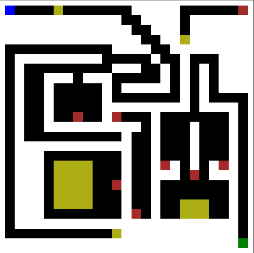

# Labirinto

> Um labirinto usando o canvas do HTML. Contem algumas mecanicas como teleporte e moedas pra ficar menos chato.

### Ajustes e melhorias

O projeto ainda está em desenvolvimento e as próximas atualizações serão voltadas nas seguintes tarefas:

- [ ] adicionar mais mundos
- [x] melhorar o sistema de muros
- [x] mehorar o sistema de mapeamento de mundo pra ser facilmente trocado
- [x] melhorar o sistema de movimento, reduzindo o numero de funcçoes
- [x] adicionar um modo multijogador, com back-end
- [x] tornar responsivel
- [x] viabilizar o game em dispositivos moveis
- [ ] Adicionar um modo de criar mapas
- [ ] add chaves e portas
- [ ] add sistema de combate (melle / bombas)
- [ ] add armadilha
- [ ] caixas

## 💻 Pré-requisitos

Antes de começar, verifique se você atendeu aos seguintes requisitos:

- Você instalou a versão mais recente de `qualquer navegador compativel com o canvas HTML`
- Você tem uma máquina `<Windows / Linux / Mac>`. ja que a versão mobile não esta pronta ainda

## ☕ Usando <Labirinto>

Para usar a versão beta do <labirinto>, clique no link:

[link](https://vinipet.github.io/labirinto/)

pra jogar a versao completa, instale a ultima versão do node JS, clone o repositorio, e execute o server.js usando o node dentro da pasta back-end. pronto basta entrar na porta descrita no terminal

## Creditos🤝 

esse projeto foi feito com base a um projeto do projeto do [Filipe Deschamps](https://github.com/filipedeschamps) modifiquei bastante ate virar um labirinto mas toda a base, quase tudo foi copiado do projeto original no [repositorio](https://github.com/filipedeschamps/meu-primeiro-jogo-multiplayer)

